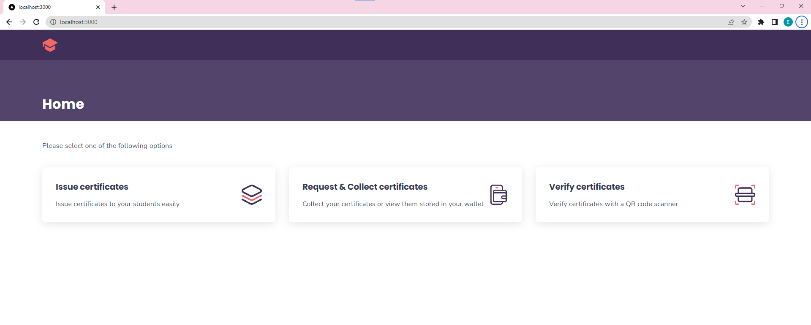
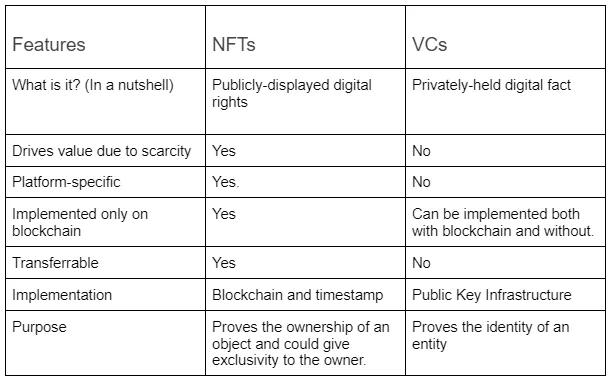
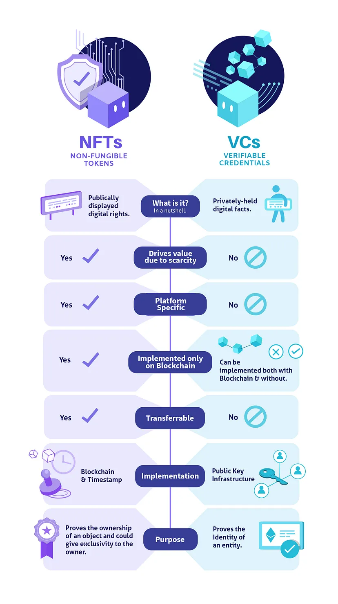

# Project Description: Property Certificate Verification System

Property Certificate Verification System is a secure and efficient solution for issuing, verifying, and storing course certificates for properties. It utilizes blockchain technology, verifiable credentials, and QR codes for authentication and easy verification.

## Team Members and Contact Information

- Eesheng Goh (GitHub: goheesheng, Email: goheesheng@hotmail.com)

## Demo Video


<aside>
    <a href="https://www.youtube.com/watch?v=6yIVSr5gBks" target="_blank">Youtube Demo Video</a>
</aside>

## Theme of Submission: Financial Inclusion

## Problem Being Addressed

The Property Certificate Verification System addresses the challenge of proving property ownership in the real estate industry. It provides a secure and efficient solution for property owners to issue, verify, and store property certificates. The system simplifies the process of proving ownership by utilizing blockchain technology, verifiable credentials, and QR codes.

 This solution enhances financial access and literacy by ensuring the authenticity and tamper-evident nature of property certificates, increasing consumers' confidence in using digital financial services. It also enables quick verification by potential buyers and anti-fraud government agencies, promoting trust and transparency in property transactions. By addressing these pain points, the system contributes to the overall goal of financial inclusion in the real estate industry.

Therefore, the Property Certificate Verification System aligns with the Financial Inclusion theme by addressing the pain points related to awareness, acceptance, availability, and affordability of existing financial products and services in the real estate industry.

## Future Plans for the Project
The team plans to enhance the user interface and user experience, add features like document management and property ownership transfer, and explore integration with existing property registration systems or government databases for seamless verification.

## Security Features
- Directory Traversal Prevention with Authentication Routes
- Fraud Detection using QR Codes

## Tech Stack Used by the Team:

- Framework: NextJS (with TypeScript and React)
- Database: Firebase
- UI Libraries: Styled Components, Tailwind CSS
- API Requests: Axios
- Credential Validation: Zod
- Logging: Pino
- Blockchain Platform: Ethereum
- Verifiable Credentials: W3C specification
- Cloud Wallet and Credential Issuance: Affinidi 
- Cloud Wallet API

## Introduction



Certification & Verification app allows you to issue, verify and store VCs in your wallet.  
You can take a role of an issuer, verifier or holder entity.

With this app it's possible to create flows without ever storing user's data, while still being able to verify it.  
Users are responsible for their data and can store it in any way they want.

The app has multiple implementations which are designed for industry-specific use cases, making it an end-to-end example of a real app that you can deploy and use right away.

## Getting started

Setting up the reference app is easy, just follow these steps:  
1. Clone the repo:
    ```
    $ git clone https://github.com/goheesheng/Hacksingapore2023.git
    ```
2. Install the dependencies:
    ```
    $ npm install
    or
    $ yarn install
    ```
3. Create a `.env` file:
    ```
    $ cp .env.example .env
    ```

    **Enter values for `NEXT_PUBLIC_PROJECT_ID`, `NEXT_PUBLIC_PROJECT_DID` and `NEXT_PUBLIC_API_KEY_HASH` from your Affinidi project properties.**

    For all aps u can find two variables: `ISSUER_LOGIN` and `ISSUER_HASH_PASSWORD`. This is only an example of usage, and it should be replaced with appropriate auth mechanism (e.g. OAuth or any other match your requirements). 
4. Launch the app:
    ```
    $ npm run dev
    ```
    
    App will be available locally on http://localhost:3000.

    > Note: To log in as issuer, use these credentials (customizable in the `.env` file):  
    > Login: **test@sbc.com**  
    > Password: **test**  

### Property use case

> Issue, verify and store course certificates.

As an Government Estate Agency (issuer), you can enter details of a certification and generate a certificate for the owner (holder).  

The owner (holder) can then store that certificate in their wallet and share it as a QR code with a recruiter or interviewer (verifier).

A potential buyer or Anti-Fraud Government Agency (verifier) can quickly verify that the certificate is valid by scanning the QR code.

## Flows

There are three flows in the app: **issuer**, **verifier** and **holder**.

### Holder flow

1. Submit hardcopy documents

### Issuer flow

1. Authenticate into your Issuer account,
2. Enter credential subject details and holder information,
3. Click "Issue".

Claim link will be sent to the holder's email address.  

### Holder flow

#### Claim a credential

1. Open the offer email in your inbox,
2. Click on the claim link,
3. Authenticate into your wallet,
4. Claim the credential and store it your wallet.

#### Share a credential

> Note: You need to claim at least one VC to perform this flow.

1. Authenticate into your wallet,
2. Select a VC that you want to share,
3. Show the QR code to the verifier.

Verifier can then read the QR code and determine whether your VC is valid or not.

### Verifier flow

1. Open the scanner page,
2. Hold the QR code in front of the camera to scan it,
3. Check the results of the verification.

## Terminology

**Verifiable Credential (VC)** – a tamper-evident credential that has authorship that can be cryptographically verified.  
_In this app, tickets, prescriptions and certificates are the subjects of the issued verifiable credentials._  
Read [W3C specification](https://www.w3.org/TR/vc-data-model/).

**Holder** – an entity that owns the verifiable credential. Usually, a holder is the subject of the credential that they hold.  
_A holder in the app is a person who stores issued VCs in their wallet._

**Issuer** – an entity that issues the verifiable credential to the holder.  
_Issuer in this app is the entity that owns the app itself and signs the credentials. For example: a university, a clinic or a ticket sales company._

**Verifier** – an entity that accepts verifiable credentials to verify their validity and authorship.  
_Verifier is an entity that accepts the VCs and verifies their authorship and validity._  

**Wallet (Cloud Wallet)** – a service that provides functionality to sign credentials (for issuers) and to store credentials in the wallet (for holders).   
_This app uses the Affinidi Cloud Wallet API for authentication, holder credential storage and credential issuance._

**Issuance API** – a service that provides functionality to offer VCs by sending a claim link to the holder's email address. Holder then opens the link and stores the issued VC in their wallet.  
_This app uses the Affinidi VC Issuance API for performing the Claim Flow._

Learn more about [VCs](https://academy.affinidi.com/what-are-verifiable-credentials-79f1846a7b9), [trust triangle](https://academy.affinidi.com/what-is-the-trust-triangle-9a9caf36b321) and [Decentralized Identifiers (DIDs)](https://academy.affinidi.com/demystifying-decentralized-identifiers-dids-2dc6fc3148fd).

# "Non-Fungible Tokens (NFTs) vs Verifiable Credentials (VCs)"

NFTs and VCs are often confused but have distinct differences.

NFTs are unique and non-interchangeable tokens used to represent digital assets. They prove ownership and authenticity.

VCs are tamper-evident credentials used to verify an entity's identity. They can represent various credentials like PII, university degrees, etc.





## Similarities

NFTs and VCs include leveraging the benefits of the digital world and providing unique identification.

## Differences:

- Implementation: (VCs use public key infrastructure and digital signatures, while NFTs are based on blockchain) 

- Transferability: (VCs are non-transferable, while NFTs can change ownership),

- Blockchain Implementation: (NFTs are blockchain-specific, while VCs can be implemented on various networks)

- Scarcity/Availability: (NFTs' value depends on scarcity, while VCs' value is unrelated to scarcity)

- Indivisibility: (NFTs are indivisible, while VCs can be divided)

NFTs verify ownership of an object, while VCs uniquely identify an entity. VCs can extend usability beyond a specific network.

Why VCs are better:

- VCs provide tamper-evident credentials that can be cryptographically verified, ensuring authenticity and preventing fraud.

- VCs offer more flexibility in sharing and verifying credentials, allowing entities to prove their claims without compromising sensitive information.

- VCs are not tied to a specific platform, unlike NFTs, which ensures the longevity and accessibility of verified credentials.

- VCs have broader applications beyond digital assets, as they can represent various credentials and enable secure identity verification across different domains.

- VCs can be implemented on different networks, including blockchain and Distributed Ledger Transaction (DLT) networks, providing interoperability and adaptability.

```
Overall, VCs offer a more robust and versatile solution for identity verification and credential management compared to NFTs, making them a better choice in many contexts.
```
